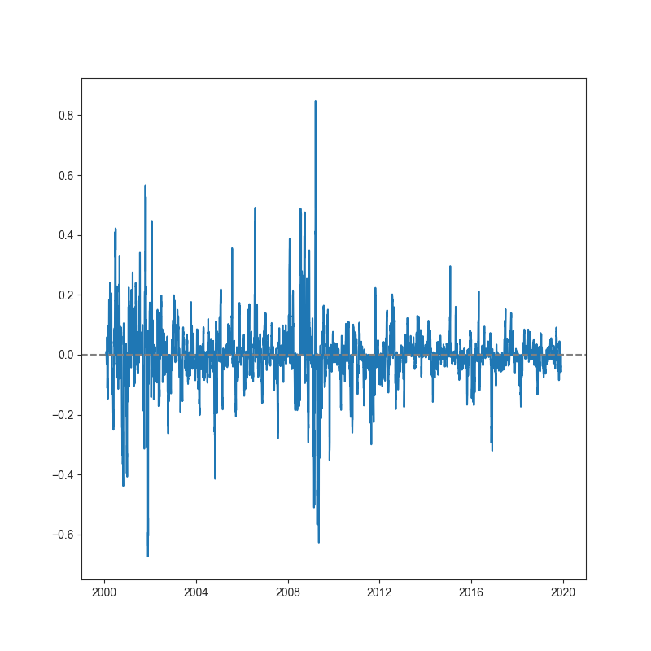
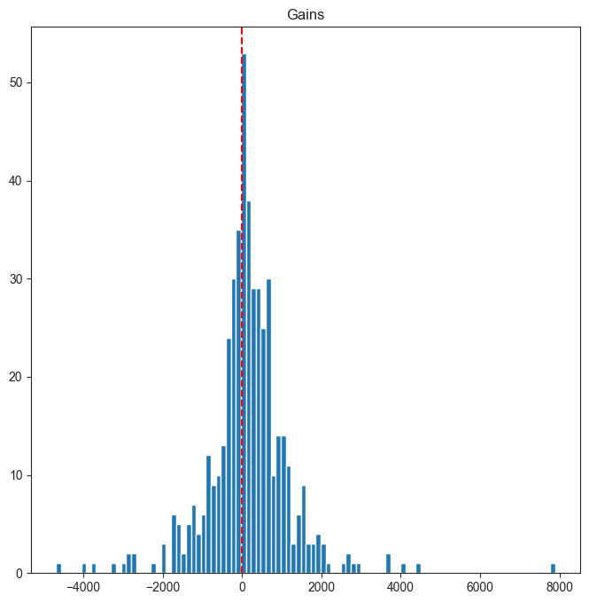

# Epymetheus

[](https://pypi.org/project/epymetheus/)
[](https://travis-ci.com/simaki/epymetheus)
[](LICENSE)

Python framework for multi-asset backtesting.


## Installation

```sh
$ pip install epymetheus
```

## Features

- Multi-asset backtesting

## How to use

Let's construct your own strategy by subclassing `TradeStrategy`.

```python
from epymetheus import TradeStrategy

class MyTradeStrategy(TradeStrategy):

    def logic(self, universe, my_parameter):
        ...
        yield Trade(...)
```

The strategy can be readily applied to any `Universe`.

```python
import pandas as pd
from epymetheus import Universe

prices = pd.DataFrame(...)  # Historical prices of assets
universe = Universe(prices, name='US Equity')

strategy = MyTradeStrategy(my_parameter=42)
strategy.run(universe)
```

Now the result is stored as the attributes of `strategy`.
You can plot the wealth right away:

```python
pd.DataFrame(strategy.wealth).plot()
```


You can also inspect the exposure as:

```python
exposure = pd.DataFrame(strategy.transaction).cumsum().sum(axis=1)
exposure.plot()
```



Profit-loss distribution of each trades can be accessed by:

```python
plt.hist(strategy.history.gains)
```



Detailed trade history can be viewed as:

```python
pd.DataFrame(strategy.history).head()
```

index|assets|lots|open_dates|close_dates|durations|open_prices|gains
-----|------|----|----------|-----------|---------|-----------|-----
0|MSFT|301.99|2000-02-01|2000-03-01|29 days|33.11|-1177.90
1|WMT|245.40|2000-02-01|2000-03-01|29 days|40.74|-1650.68
2|BRK-A|0.22|2000-03-01|2000-04-01|31 days|44700|0,2796.42
3|WMT|293.91|2000-03-01|2000-04-01|31 days|34.02|1545.11
4|JNJ|480.09|2000-04-01|2000-05-01|30 days|20.82|1770.46

Other examples are provided [here](sample/examples/).
