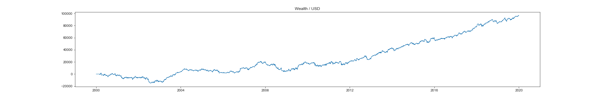
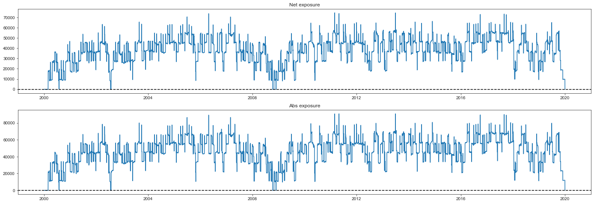
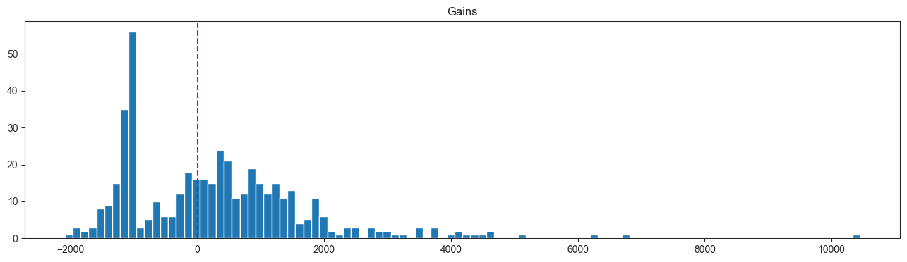

# Epymetheus

[](https://pypi.org/project/epymetheus/)
[](https://travis-ci.com/simaki/epymetheus)
[](https://codecov.io/gh/simaki/epymetheus)
[](https://pypi.org/project/epymetheus/)
[](LICENSE)

Python library for multi-asset backtesting.



## Installation

```sh
$ pip install epymetheus
```

## Features

- Multi-asset backtesting

## How to use

[](https://colab.research.google.com/github/simaki/fracdiff/blob/master/examples/howto/howto.ipynb)

Let's construct your own strategy by subclassing `TradeStrategy`.

```python
from epymetheus import Trade, TradeStrategy


class MyStrategy(TradeStrategy):
    """
    This is my favorite strategy.
    
    Parameters
    ----------
    - my_parameter : float
        My awesome parameter.
    """
    def __init__(self, my_parameter):
        self.my_parameter = my_parameter
        
    def logic(self, universe):
        ...
        yield Trade(...)


strategy = MyStrategy(my_parameter=0.1)
```

The strategy can be readily applied to any `Universe`.

```python
from epymetheus import Universe

prices = ...  # Fetch historical prices of US equities
universe = Universe(prices)

strategy.run(universe)
# Running ... 
# Generating 454 trades (2018-12-31) ... Done. (Runtime : 0.45 sec)
# Executing 454 trades ... Done. (Runtime : 0.73 sec)
# Done. (Runtime : 1.17 sec)
```

Now the result can be evaluated as the attributes of `strategy`.
You can plot the wealth right away:

```python
df_wealth = strategy.wealth.to_dataframe()

df_wealth.plot()
```


You can also inspect the exposure as:

```python
net_exposure = pd.Series(strategy.net_exposure)
net_exposure.plot()
```



Profit-loss distribution can be accessed by:

```python
plt.hist(strategy.history.pnl)
```



Detailed trade history can be viewed as:

```python
strategy.history.to_dataframe()

# or: pandas.DataFrame(strategy.history)
```

index|assets|lots|open_dates|close_dates|durations|open_prices|gains
-----|------|----|----------|-----------|---------|-----------|-----
0|MSFT|301.99|2000-02-01|2000-03-01|29 days|33.11|-1177.90
1|WMT|245.40|2000-02-01|2000-03-01|29 days|40.74|-1650.68
2|BRK-A|0.22|2000-03-01|2000-04-01|31 days|44700|0,2796.42
3|WMT|293.91|2000-03-01|2000-04-01|31 days|34.02|1545.11
4|JNJ|480.09|2000-04-01|2000-05-01|30 days|20.82|1770.46
...|...|...|...|...|...|...|...
