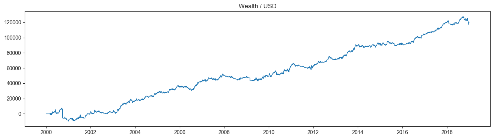

# Epymetheus

[](https://pypi.org/project/epymetheus/)
[](https://travis-ci.com/simaki/epymetheus)
[](https://travis-ci.com/simaki/epymetheus)
[](LICENSE)

Python framework for multi-asset backtesting.



## Installation

```sh
$ pip install epymetheus
```

## Features

- Multi-asset backtesting
- Financial data scraping

## How to use

Let's construct your own strategy by subclassing `TradeStrategy`.

```python
from epymetheus import TradeStrategy

class MyTradeStrategy(TradeStrategy):
    """
    This is my favorite trade strategy.
    """
    def logic(self, universe, my_parameter):
        ...  # your logic
        yield Trade(asset=..., lot=..., open_date=..., close_date=...)
```

The strategy can be readily applied to any universe.

```python
import pandas as pd
from epymetheus import Universe

prices = pd.DataFrame(...)  # Historical prices of assets
universe = Universe(prices, name='US Equity')

strategy = MyTradeStrategy(my_parameter=42)
strategy.run(universe)
# Generating trades...
# Evaluating wealth...
# Done.
# Runtime: ***sec
```

Now you can access the result as the attributes of strategy.

```python
pd.DataFrame(strategy.wealth)
# ...
pd.DataFrame(strategy.transaction)
# ...
pd.DataFrame(strategy.history)
# ...
```

Sample result is provided [here](sample/howto/)
