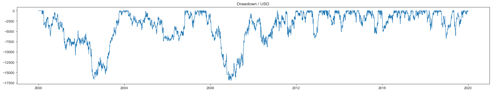
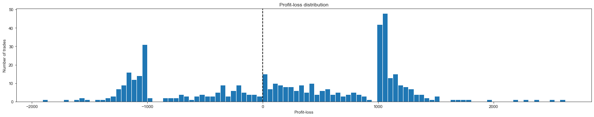

# Epymetheus: Python Library for Multi-asset Backtesting

[](https://pypi.org/project/epymetheus/)
[](https://pypi.org/project/epymetheus/)
[](https://travis-ci.com/simaki/epymetheus)
[](https://codecov.io/gh/simaki/epymetheus)
[](https://pypi.org/project/epymetheus/)
[](LICENSE)
[](https://github.com/psf/black)


## Introduction

Epymetheus is a Python library for multi-asset backtesting.
It provides end-to-end framework that lets analysts build and try out their trade strategy right away.

### Features

1. **Simple and Intuitive API**: The API is minimally organized so that you can focus on your idea. Trade `Strategy` can be readily coded and its backtesting is consistently carried out by its methods `run()` and `evaluate()`.
2. **Seamless connection to [Pandas](https://github.com/pandas-dev/pandas)**: You can just put in pandas DataFrame as an input historical data. Backtesting results can be quickly converted to Pandas format so that you can view, analyze and plot results by the familliar Pandas methods.
3. **Extensiblity with Other Frameworks**: Epymetheus only provides a framework. Strategy can be readily built with other libraries for machine learning, econometrics, technical indicators, derivative pricing models and so forth.
4. **Efficient Computation**: Backtesting engine is boosted by numpy. You can give your own idea a quick try.
5. **Full Test Coverage**: Library is thoroughly tested with 100% test coverage for multiple Python versions.

### Modules

1. **[Strategy](https://github.com/simaki/epymetheus/tree/master/epymetheus/strategy)**: A strategy encodes your own trading rules. The [`benchmarks`](https://github.com/simaki/epymetheus/tree/master/epymetheus/benchmarks) provide standard strategies to be compared with.
2. **[Universe](https://github.com/simaki/epymetheus/tree/master/epymetheus/universe)**: A universe stores historical prices of a set of securities. The [`datasets`](https://github.com/simaki/epymetheus/tree/master/epymetheus/datasets) provides sample universe like Brownian stock prices and blue chips in US.
3. **[History](https://github.com/simaki/epymetheus/tree/master/epymetheus/history)**: A history stores the assets, lots, profit/loss of each trade yielded. Easily converted into Pandas DataFrame.
4. **[Metric](https://github.com/simaki/epymetheus/tree/master/epymetheus/metric)**: A metric is a function to assess the performance of your strategy. Available metrics include: final wealth, maximum drawdown, Sharpe ratio and so forth.

### Integrations

Strategies may be integrated with:

- **Machine Learning**: [scikit-learn](https://github.com/scikit-learn/scikit-learn), [TensorFlow](https://github.com/tensorflow/tensorflow), [PyTorch](https://github.com/pytorch/pytorch), etc.
- **Econometrics**: [statsmodels](https://github.com/statsmodels/statsmodels), etc.
- **Technical Indicators**: [TA-Lib](https://github.com/mrjbq7/ta-lib), etc.
- **Derivative Pricing**: [TF Quant Finance](https://github.com/google/tf-quant-finance), etc.

## Installation

```sh
$ pip install epymetheus
```

## How to use

[](https://colab.research.google.com/github/simaki/epymetheus/blob/master/examples/howto/howto.ipynb)

Let's construct your own `Strategy`.

```python
from epymetheus import Trade, Strategy


class MyStrategy(Strategy):
    """
    This is my favorite strategy.

    Parameters
    ----------
    - my_parameter : float
        My awesome parameter.
    """
    def __init__(self, my_parameter):
        self.my_parameter = my_parameter

    def logic(self, universe):
        ...
        yield Trade(...)


strategy = MyStrategy(my_parameter=0.1)
```

Your strategy can readily be backtested with any `Universe`.

```python
from epymetheus.datasets import fetch_usstocks

universe = Universe(df_prices)  # The historical prices that you have, or
universe = fetch_usstocks(n_assets=10)  # Basic datasets provided by Epymetheus.

strategy.run(universe)
# Running ...
# Generating 478 trades (2019-12-31) ... Done. (Runtime : 0.30 sec)
# Executing 478 trades ... Done. (Runtime : 0.41 sec)
# Done. (Runtime : 0.71 sec)
```

Now the results can be accessed as the attributes of `strategy`.
You can plot the wealth right away:

```python
df_wealth = strategy.wealth.to_dataframe()

df_wealth.plot()
```


You can also quickly `evaluate` various metrics of the perfornance.

For example, drawdown, exposure and Sharpe ratio are given by:

```python
from epymetheus.metrics import Drawdown, MaxDrawdown, Exposure, SharpeRatio

drawdown = strategy.evaluate(Drawdown())
max_drawdown = strategy.evaluate(MaxDrawdown())
net_exposure = strategy.evaluate(Exposure(net=True))
abs_exposure = strategy.evaluate(Exposure(net=False))
sharpe_ratio = strategy.evaluate(SharpeRatio())
```




Detailed trade history can be viewed as:

```python
strategy.history.to_dataframe()
# or: pandas.DataFrame(strategy.history)
```

|   order_id |   trade_id | asset   |         lot | open_bar   | close_bar  | shut_bar   |   take |   stop |      pnl |
|-----------:|-----------:|:--------|------------:|:-----------|:-----------|:-----------|-------:|-------:|---------:|
|          0 |          0 | AMZN    | 145.191     | 2000-02-29 | 2000-04-05 | 2000-05-29 |   1000 |  -1000 | -970.962 |
|          1 |          0 | BRK-A   |  -0.0227273 | 2000-02-29 | 2000-04-05 | 2000-05-29 |   1000 |  -1000 | -288.636 |
|          2 |          1 | JPM     | 346.101     | 2000-02-29 | 2000-03-16 | 2000-05-29 |   1000 |  -1000 | 1318.68  |
|          3 |          1 | WMT     | -29.9542    | 2000-02-29 | 2000-03-16 | 2000-05-29 |   1000 |  -1000 | -121.923 |
|          4 |          2 | BRK-A   |   0.174825  | 2000-03-31 | 2000-06-30 | 2000-06-30 |   1000 |  -1000 | -594.406 |

Profit-loss distribution can be accessed by:

```python
pnl = strategy.history.groupby('trade_id').aggregate(sum).pnl
plt.hist(pnl)
```


