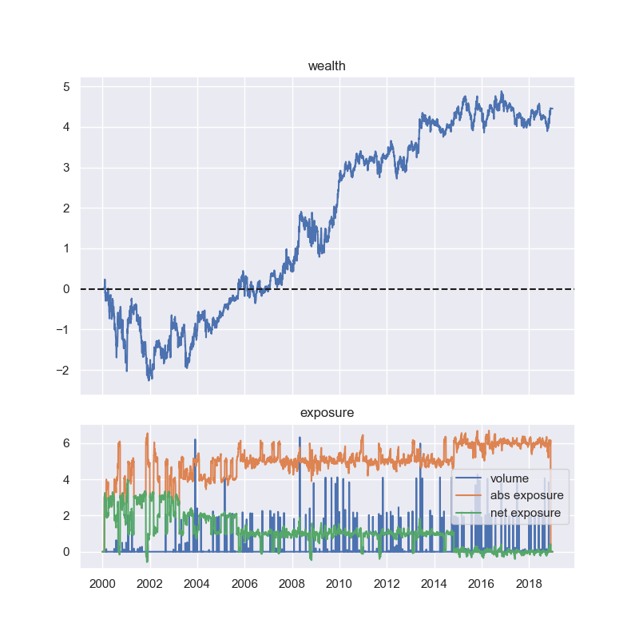
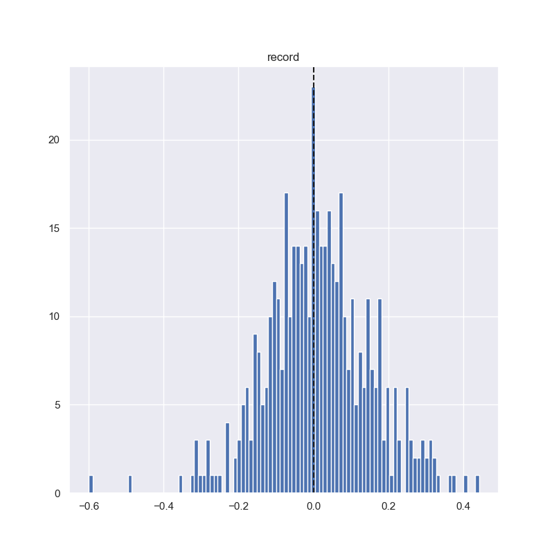

# SimpleMeanReversion
A simple trend-following strategy that buys stocks for a month with
the lowest percentile one month returns and sells the highest percentile returns.

Parameters
----------
- percentile : float
    The threshold to buy or sell.
    E.g. If 0.1, buy/sell stocks with returns of lowest/highest 10%.

## Parameters used
- **percentile** : 0.1

## Universe
- **Universe** : JP Equity
- **Period** : 2000/01/01 - 2018/12/31 (6939 days)

|wealth and exposure|record|
|:-:|:-:|
|||

## Overview
- **fin wealth** : 6.20427
- **max drop** : -1.34007
- **avg gain** : 0.01228
- **med gain** : 0.00987

## Trade statistics
- **num trade** : 452
- **avg duration** : 29 days
- **med duration** : 30 days
- **max duration** : 30 days
- **min duration** : 27 days

## Win and lose
|        |   win   |  lose   |
|--------|--------:|--------:|
|num     |242.00000|210.00000|
|avg gain|  0.11188| -0.10249|
|med gain|  0.08612| -0.08101|
|max gain|  0.44157| -0.00016|
|min gain|  0.00008| -0.59948|

Backtest runtime : 2.5 sec